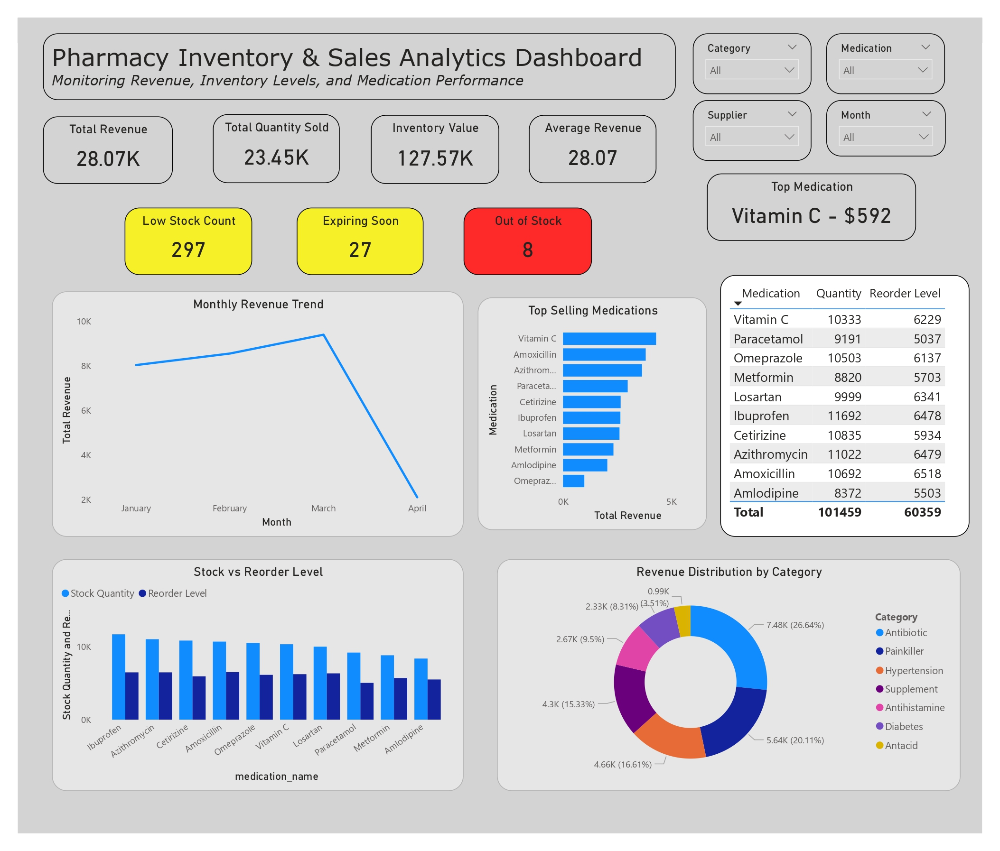

# 🏥 Pharmacy Inventory & Sales Analytics Dashboard

## 📌 Overview

This project analyzes pharmacy inventory and sales data to generate actionable insights using MySQL and Power BI. It focuses on tracking revenue performance, monitoring stock levels, and identifying risks such as low inventory and expiring medications.

---

## 🎯 Objectives
* Evaluate overall sales and revenue performance
* Monitor inventory levels and stock availability
* Identify medications at risk of stockout or expiration
* Build an interactive dashboard for data-driven decision-making

---

## 🛠️ Tools & Technologies
* **MySQL** – Data extraction, joins, and aggregations
* **Power BI** – Data modeling, DAX calculations, and dashboard design
* **Excel** – Data preparation and cleaning
  
---

## 🤖 Use of AI

AI tools were used to assist in:

* Created realistic synthetic healthcare dataset
* Used nested queries to calculate metrics such as returning patients
* Utilized DATE_FORMAT() to group data by month and year for time-based trend analysis
* Built logic for calculating percentage rates 
* Debugging errors in SQL and DAX
* Structuring calculations for Power BI

All outputs were manually validated and refined to ensure accuracy and reliability.

---

## 🗄️ Dataset Structure

📦 meds_data  
* medication_id  
* medication_name  
* category  
* stock_quantity  
* reorder_level  
* unit_price  
* expiry_date  

💊 sales_data  
* sale_id  
* medication_id  
* quantity_sold  
* sale_date  

---

## 📊 Key Performance Indicators (KPIs)  
* 💰 Total Revenue  
* 📦 Total Quantity Sold  
* 🧮 Inventory Value  
* ⚠️ Low Stock Count  
* 🚨 Out of Stock  
* ⏳ Expiring Soon  
* 📊 Average Revenue per Medication  
* 🥇 Top Selling Medication  

---
    
## 📈 Power BI Dashboard Features
* KPI cards for quick performance overview
* Monthly revenue trend (line chart)
* Top-selling medications (bar chart)
* Revenue distribution by category (donut chart)
* Stock vs reorder level comparison
* Low stock and out-of-stock monitoring
* Expiry tracking by month
* Interactive slicers (category, medication, date)

---

## 🧠 Key Insights
* A small group of medications drives the majority of total revenue
* Several medications frequently fall below reorder levels, indicating supply risk
* Some inventory is nearing expiration, increasing the risk of wastage

---

## 📸 Dashboard Preview

---

## 🚀 Future Improvements
* Add demand forecasting  
* Implement automated refresh  
* Add drill-through and tooltips  

## 👤 Author

Adriane Clark Ballesteros  
Healthcare Data Analyst Trainee

* 🔗 GitHub: https://github.com/acbshields12

---
